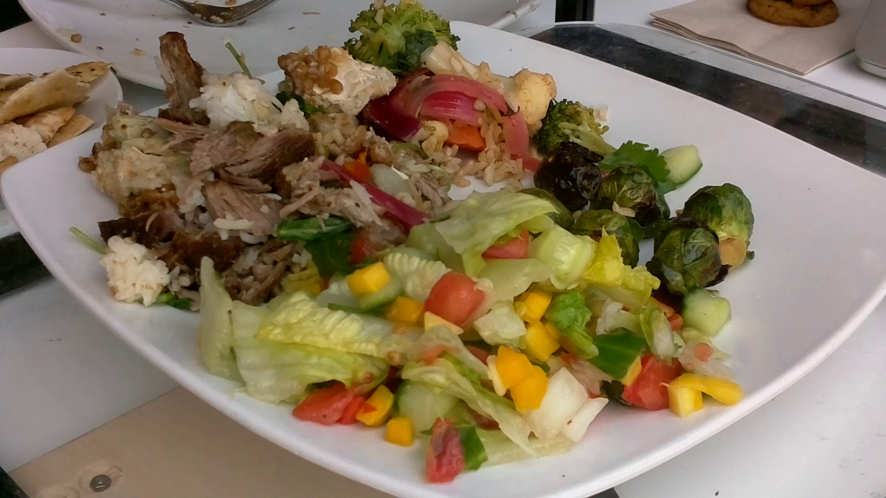
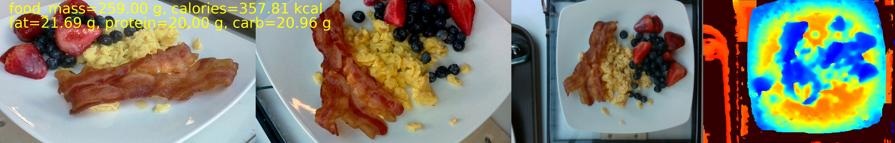
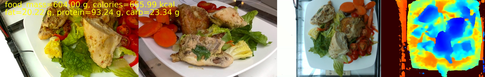
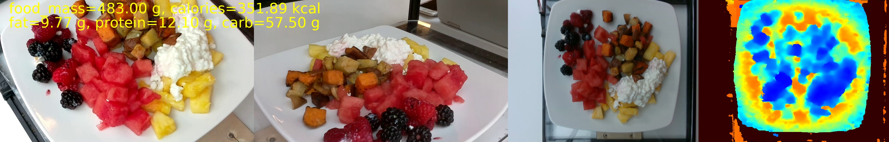
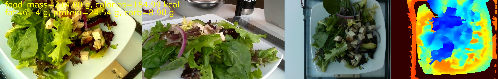
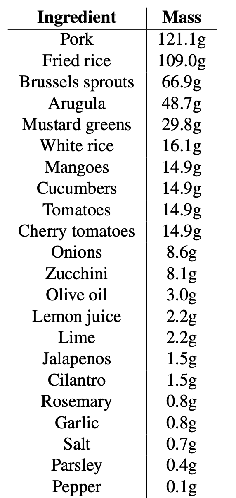
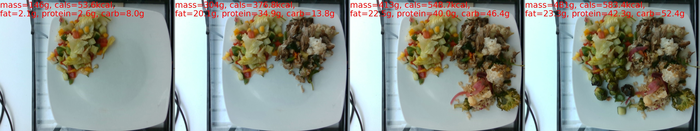

<div align="center">

# Nutrition5k: A Comprehensive Nutrition Dataset

<p align="center">
	
	
</p>

<p align="center">
	<a href="https://arxiv.org/pdf/2103.03375.pdf"><b>Paper</b></a> •
	<a href="#download-data"><b>Download Data</b></a> •
	<a href="#dataset-contents"><b>Dataset Contents</b></a> •
	<a href="#license--contact"><b>License & Contact</b></a>
</p>

</div>

<b>Nutrition5k</b> is a dataset of visual and nutritional data for ~5k realistic plates of food captured from Google cafeterias using a custom scanning rig. We are releasing this dataset alongside our recent <a href="https://arxiv.org/abs/2103.03375">CVPR 2021 paper</a> to help promote research in visual nutrition understanding. Please see the paper for more details on the dataset and follow-up experiments.

### Key Features
<ul>
	<li>Scans data for 5,006 plates of food, each containing:
		<ul>
			<li>4 rotating side-angle videos</li>
			<li>Overhead RGB-D images <i>(when available)</i></li>
			<li>Fine-grained list of ingredients</li>
			<li>Per-ingredient mass</li>
			<li>Total dish mass and calories</li>
			<li>Fat, protein, and carbohydrate macronutrient masses</li>
		</ul></li>
	<li>Official train/test split</li>
	<li>Nutrition regression eval scripts</li>
</ul>

<i>→ [Also, see our related <a href="https://tfhub.dev/google/seefood/segmenter/mobile_food_segmenter_V1/1">Mobile Food Segmentation model on TensorFlow Hub</a>]</i>

### Download Data
All Nutrition5k data can be downloaded directly from our [Google Cloud Storage bucket](https://console.cloud.google.com/storage/browser/nutrition5k_dataset), or from the .tar.gz download link below.
<ul>
	<li><a href="https://storage.cloud.google.com/nutrition5k_dataset/nutrition5k_dataset.tar.gz">nutrition5k_dataset.tar.gz</a> (181.4 GB)
</ul>

From the Cloud Storage bucket directory, you can also browse through the dataset folders and download specific files using the `gsutil cp` command:
```
gsutil -m cp -r "gs://nutrition5k_dataset/nutrition5k_dataset/{FILE_OR_DIR_PATH}" .
```

See [here](https://cloud.google.com/storage/docs/gsutil) for instructions on installing the `gsutil` tool.

### Examples

<p align="center">
	
	
	
	
	<i><b>Example side-angle and overhead frames, with nutrition labels.</b></i>
</p>

<!--### Dish Ingredient Label


-->

<p align="center">
	
	<i><b>Example of the incremental scanning procedure.</b></i>
</p>


## Dataset contents

#### Side-Angle Videos
Video recordings were captured using 4 separate Raspberry Pi cameras (labeled A-D) at alternating 30 degree and 60 degree viewing angles. The cameras are positioned 90 degrees apart and sweep 90 degrees during video capture so that the dish is captured from all sides.
Video files are found in `imagery/side_angles/` and are organized by dish id. To extract all 2D image frames from a video, use ffmpeg as shown below:
```
ffmpeg -i input.mp4 output_%03d.jpeg
```

The models included in the Nutrition5k paper were trained and evaluated on every fifth frame sampled from each video, and we include two scripts to help with this. `scripts/extract_frames.sh` walks through each dish_id directory, extracts each frame from all four videos, and outputs the frames to a newly created `dish_ID/frames/` directory. `scripts/extract_frames_sampled.sh` accepts a command line argument to extract only every nth frame from each video.

```
cp scripts/extract_frames*.sh imagery/side_angles
cd imagery/side_angles
sh extract_frames.sh
sh extract_frames_sampled.sh 5
```

#### Overhead RGB-D Images
The `imagery/realsense_overhead/` directory contains RGB, raw depth, and colorized depth images organized by dish ID. Raw depth images are encoded as 16-bit integer images with depth units of 10,000 (i.e. 1 meter = 10,000 units). The colorized depth images provide a human-readable visualization of the depth map, with closer objects in blue and further objects in red. All depth values are rounded to a maximum of 0.4m (4,000 depth units), which exceeds the height of our food scanning rig.

#### Ingredient Metadata
The ingredient metadata CSV (`metadata/ingredient_metadata.csv`) contains a list of all ingredients covered in the dataset's dishes, their unique IDs, and per-gram nutritional information sourced from the USDA Food and Nutrient Database. Ingredient IDs take the following form: `ingr_[ingredient number padded to 10 digits]`.

#### Dish Metadata
The dish metadata CSVs (`metadata/dish_metadata_cafe1.csv` and `metadata/dish_metadata_cafe2.csv`) contain all nutrition metadata at the dish-level, as well as per-ingredient mass and macronutrients. For each dish ID `dish_[10 digit timestamp]`, there is a CSV entry containing the following fields: 

<i>dish_id, total_calories, total_mass, total_fat, total_carb, total_protein, num_ingrs, (ingr_1_id, ingr_1_name, ingr_1_grams, ingr_1_calories, ingr_1_fat, ingr_1_carb, ingr_1_protein, ...)</i>

with the last 8 fields are repeated for every ingredient present in the dish.

#### Train/Test Splits
We include dish IDs for the training and testing splits used in our experiments in the `dish_ids/splits/` directory. All incremental scans that compose a unique plate are held within the same split, to avoid overlap between the train and test splits. See Section 3.6 of our paper for more details on incremental scanning.

#### Evaluation Script
To help evaluate nutrition prediction methods, we provide `scripts/compute_eval_statistics.py`. This script can be used to calculate absolute and percentage mean average error from a CSV of per-dish nutrition values. This tool can be used to generate regression results that can be directly compared to those reported in our paper. See the header file for usage instructions.

## Dataset Bias Disclaimer
The dataset does not cover all food cuisines, as it was only collected in a few select cafeterias in California, USA. Nutrition5k does not claim to completely solve the food understanding problem, but rather aims to provide a unique level of detailed annotations and depth data to further advance the space.

## License & Contact
We release all Nutrition5k data under the <a href="https://creativecommons.org/licenses/by/4.0/">Creative Commons V4.0</a> license. You are free to share and adapt this data for any purpose, even commercially. If you found this dataset useful, please consider citing our [CVPR 2021 paper](https://arxiv.org/pdf/2103.03375.pdf).
```
@inproceedings{thames2021nutrition5k,
  title={Nutrition5k: Towards Automatic Nutritional Understanding of Generic Food},
  author={Thames, Quin and Karpur, Arjun and Norris, Wade and Xia, Fangting and Panait, Liviu and Weyand, Tobias and Sim, Jack},
  booktitle={Proceedings of the IEEE/CVF Conference on Computer Vision and Pattern Recognition},
  pages={8903--8911},
  year={2021}
}
```

If you have any questions about the Nutrition5k dataset or paper, please send an email to the authors at <a href="mailto:nutrition5k@google.com">nutrition5k@google.com</a>.


Thank you to Ben Goldberger, Caitlin O'Brien, and the Google LAX/PLV Cafeteria teams for their contributions!
